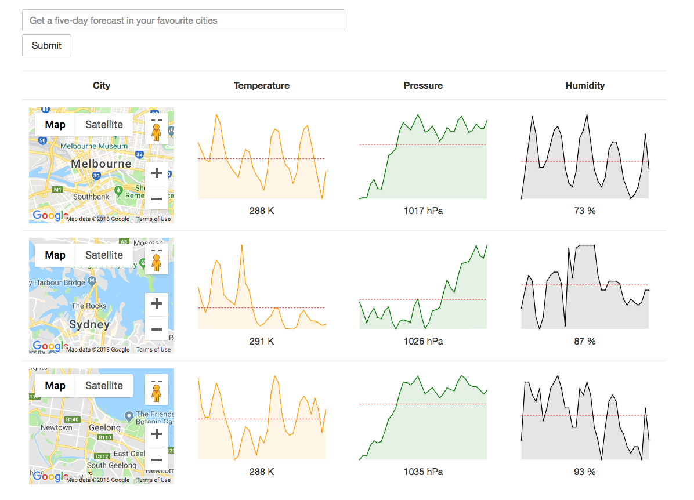

# redux-promise-weather-forecast

A weather forecasting app that allows a user to type in a city and see weather details during the next five days

Below is a snapshot of the app.




### Getting Started

Clone this repo, install dependencies, then start the gulp process with the following:

```
> cd redux-promise-weather-forecast
> npm install
> npm start
```
